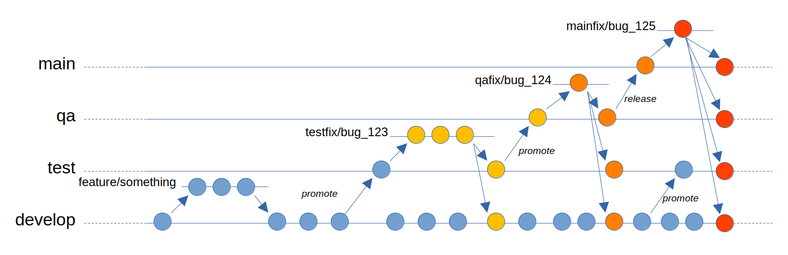

# Git Branch Management System (BMS)

Git-bms is a custom git command freely inspired by git flow. The aim of the command is to extend git-flow to support, in an opinionated way, multi non-production branches repositories.

## The branch system

In the diagram "develop" is the development branch and "main" the production one. In the middle there are two non-production branches called "test" and "qa". BMS allows to define as many non-productive branches as you want (minimum 1: the development one), so in this example there are 3 non-production branches and the production one. The core concept is that when a fix is being developed on a branch, it will be applied to all the branches *before* it. The list and sequence of the branches is defined during the bms init command.

## Features

- [x] `git bms init` : initializes bms for the current repository, defining the non-production and the production branches. It also allows to choose what strategy to use when applying feature branches on the development one (merge or cherry-pick).
- [x] `git bms feature` : just like flow, it allows to start a new feature branch, or to finish it merging and (by default, optionally) deleting the local feature branch. Merge or cherry-pick will be used as specified during the initialization.
- [ ] `git bms fix` : instead of having "hotfix" branches for fixes only, bms allows to have fixes on any branch (excluding the development one). The fix will be branched from the current branch and once finished applied in a cascade fashion to the former branch and all the previous ones. For example, if the branches are **develop -> test -> qa -> main**, and a fix is required for the *qa* environment, a new "qafix" can be started and, once finished, it will be applied on **qa, test and develop**.
- [ ] `git bms promote` : promotes a non-production branch into the next one in series. For example if the current branch is *develop* and BMS has been configured to have the following branches: **develop -> test -> qa -> main**, the command will apply *develop* into *test*. The last non-production branch can't be promoted: it needs to be *released*.
- [ ] `git bms release` : promotes the last non-production branch to a release in the production branch. It acts exactly like `promote`, but using a different wording which helps preventing accidental production changes.

## Side notes
BMS does not work on branches that have slashes in their names, for example *env/devel*, as git only allows one slash per branch name, and it will be used for the hotfix branches.